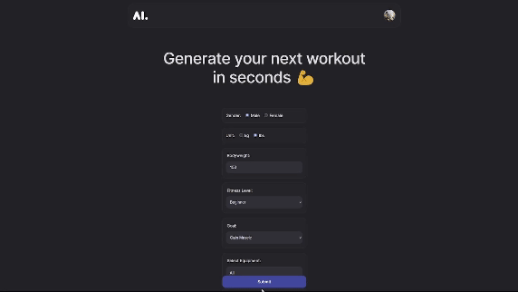

# OpenAI Workout Generator

This fitness application, featured in my portfolio, is a dynamic and user-friendly tool built using React. 
This app leverages OpenAI LLM and its API to retrieve information such as workout exercises and their ideal combinations based on user goals, equipment and preferences. 

User info is collected through a form where the state is updated with each input. 
User Data is then collected as a state object and used as a reference during API communication. 
OpenAI LLM (Language Learning Model) is given the instruction to respond in a JSON format, the response is then converted into a javascript object.
The output has an expected structure, with days as the first keys and exercises as children objects. This allows me to store specific data into variables and map each day to dynamically populate UI elements only if needed and as I visually want.

## Technologies

- **REACT**
- **RESTful APIs**, OpenAI
- **CSS-in-JS**, Emotion
- **Bundler**, VITE
- **Serverless functions**, Vercel
- **Web Analytics**, Vercel
- **Authentication**, AUTH0

## Deployment

This project is live at https://open-ai-workout-generator.vercel.app/.

<p align="center"> 
  <kbd>
    <a href="https://open-ai-workout-generator.vercel.app/" target="_blank"></a>
  </kbd>
</p>


## Key Features

- **Dynamic experience**: Footer and User Profile after login change based on user's fitness goals.
- **Workout data dynamically populates the UI**: UI tables are generated only if there is data for that day and variables are extracted from the response and displayed on the tables with a defined structure.
- **Modular Software Design**: Each component is crafted to be as modular as possible, ensuring a clean separation of concerns and responsibilities between components. Custom Hooks and functions like "useOutsideClicks" are reused across different components.
- **Emotion & Reusable Styles**: To avoid the clutter and inconvenience of traditional CSS, I used Emotion. It allowed me to style components directly within their files and integrate them with a theme styles file.
- **Serverless Functions with Vercel**: Inside the API folder you can see the serverless functions I used to make the calls to Openai API, which usually would require a dedicated server, which I successfully implemented before discovering the convenience of serverless (see server repository in my profile).
- **Authentication with Auth0**: Minimum setup to implement authentication.

## Learning Journey

This project was a learning curve in understanding what it takes to build a functional product from 0 to 1. The journey involved:

- Understanding the flow and management of states in React, in particular, collecting data through form components, giving it to fetching functions and displaying the result in the workout tables.
- Understanding the purpose of isolation and responsibility in the codebase, towards the end, I could really see modularity and separation of responsibilities becoming increasingly important.
- Managing styling with Emotion and javascript objects, choosing the right styles to share across components, framer motion animations and ensuring a good UX.
- Implementing authentication, following Auth0 guidelines.
- Implementing a little server with Heroku, which got me some headaches at first and was not even in the scope of the front end. After successfully implementing it, I went on using Vercel serverless functions for cost convenience.

The mantra for this project: Connect data seamlessly, and keep logic distinct and modular.

## Components Map

```
App.jsx/
│
├─ MetaData.jsx
│
├─ Header.jsx
│   ├── AuthenticationButton.jsx
│         ├── ProfileImage.jsx
│         └── ProfileInfo.jsx
│
├─ MainHeading.jsx
│
├─ WorkoutForm.jsx
│
├─ WorkoutResult.jsx
│   └── WorkoutProgram.jsx
│         └── DailyTables.jsx
│  
├─ WorkoutForm.jsx
│   ├── RadioButton.jsx
│   ├── Multiselection.jsx
│   ├── Slider.jsx
│   └── OtherInputs.jsx
│         ├── Bodyweight
│         ├── Selection
│         └── TextArea
│  
└── Footer.jsx
```

## Conclusion

The OpenAI Workout Generator was a big learning experience. 

Keeping data connected between different components, a.k.a. managing the flow of states, was one of the most fascinating tasks I have done so far. 

The beginning is straightforward and flows well. Towards the end, you really get a feel for how important modularity is — especially when you make tiny tweaks. You fix the issue, but then you break something completely elsewhere. I bet we all know that feeling.

I did enjoy keeping the code as clean as possible with Emotion and a few comments. 

This was a project that I wanted to build before even knowing how to code. Seeing it becoming a reality from a thought was fulfilling and rewarding. 

Moving forward, I am excited to widen and deepen my knowledge in the front end (and why not, also AI engineering), along with a strong attention to User Experience.

## Contact

- **Email**: gianniruggieri@outlook.com
- **Portfolio**: https://www.desengineers.co/
- **GitHub Profile**: https://github.com/GRdevelops/
